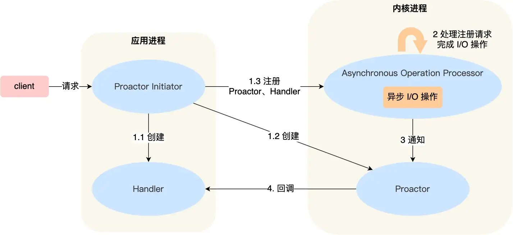

# epoll基础介绍  
## 1. epoll类  
成员变量：
    - epoll文件描述符epfd  
    - epoll_event 
class epoll{  
private:  
    int epfd;  
    struct epoll_event *events;  
public:  
    epoll();  
    ~epoll();  

    void addFd(int fd, uint32_t op);  
    void updateChannel(Channel *);  
    std::vector<Channel*> poll(int timeout == -1);  
}  

## 2. epoll_event结构体  
成员变量：  
    - uint32_t类型的events字段标识事件类型；
    - epoll_data_t类型的data字段存放数据  

struct epoll_event{  
    uint32_t events; //epoll事件，参考事件列表  
    epoll_data_t data;  
};  
typedef union epoll_data{  
    void *ptr;  
    int fd; //套接字描述符  
    uint32_t u32;  
    uint64_t u64;  
} epoll_data_t;  

## 3. epoll的events事件  
enum EPOLL_EVENTS  
{  
    EPOLLIN = 0x001, //读事件  
    EPOLLPRI = 0x002,  
    EPOLLOUT = 0x004, //写事件  
    EPOLLRDNORM = 0x040,  
    EPOLLRDBAND = 0x080,  
    EPOLLWRNORM = 0x100,  
    EPOLLWRBAND = 0x200,  
    EPOLLMSG = 0x400,  
    EPOLLERR = 0x008, //出错事件  
    EPOLLHUP = 0x010, //出错事件  
    EPOLLRDHUP = 0x2000,  
    EPOLLEXCLUSIVE = 1u << 28,  
    EPOLLWAKEUP = 1u << 29,  
    EPOLLONESHOT = 1u << 30,  
    EPOLLET = 1u << 31 //边缘触发  
};  

## 4. 相关函数介绍  
- epoll_create: 创建一个epoll文件描述符，用于后续epoll操作，目前size没啥用，填一个大于0的数就行了  
int epoll_create(int size);  

- epoll_ctl: 用于增加，删除，修改epoll事件，epoll事件会存储在内核epoll结构体红黑树  
int epoll_ctl(int epfd, int op, int fd, struct epoll_event *event);  
返回值：成功返回0，失败返回-1  

- epoll_wait: 用于监听套接字的事件，可以通过设置超时时间timeout来控制监听行为阻塞模式还是超时模式  
int epoll_wait(int epfd, struct epoll_event *events, int maxevents, int timeout)  
参数：  
epfd  
events: epoll事件数组，用来存储监听到的事件  
maxevnets: epoll事件数组的大小  
timeout: 超时时间  
    - 小于0: 表示阻塞模式，一直等待  
    - 等于0：表示非阻塞模式，立即返回  
    - 大于0：表示超时模式，等待timeout毫秒，如果超时还没监听到事件，则返回  
返回值：  
    - 小于0：出错  
    - 等于0：超时  
    - 大于0：返回就绪事件的个数  

## 5. LT和ET模式  
    - 4.1 LT模式：水平触发  
        - socket读触发：socket接收缓冲区有数据，会一直触发epoll_wait EPOLLIN事件，直到数据被用户读取完  
        - socket写触发：socket可写，会一直触发epoll_wait EPOLLOUT事件  
    - 4.2 ET模式：边缘触发  
        - socket读触发：socket数据从无到有，会触发epoll_wait EPOLLIN事件，只会触发一次EPOLLIN事件，用户检测到事件后，需要一次性把socket接收缓冲区的数据全部读取完，读取完的标志未recv返回-1，errno设置为EAGAIN  
        - socket写触发：socket可写，会触发一次epoll_wait EPOLLOUT事件  

# channel基础介绍  

# Reactor模式 

# Proactor模式  
  
介绍一下 Proactor 模式的工作流程：  
Proactor Initiator 负责创建 Proactor 和 Handler 对象，并将 Proactor 和 Handler 都通过   
Asynchronous Operation Processor 注册到内核；  
Asynchronous Operation Processor 负责处理注册请求，并处理 I/O 操作;  
Asynchronous Operation Processor 完成 I/O 操作后通知 Proactor；  
Proactor 根据不同的事件类型回调不同的 Handler 进行业务处理；  
Handler 完成业务处理；  
